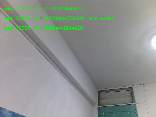

## **What Is This?**

This demo is designed to showcase how developers can manually compose ROS2 nodes by defining them separately but combining them in varied process layouts while avoiding code overhauls or restriction. This package consists of the following ROS2 nodes:

1. `camera_node`
2. `watermark_node`
3. `image_view_node`
4. `image_pipeline_all_in_one`
5. `two_node_pipeline`
6. `cyclic_pipeline`
7. `image_pipeline_with_two_image_view`

Through the use of intra-process (as opposed to standalone/inter-process node communication), lower latency and thus higher efficiency is observed for ROS2 topologies that utilizes this manner of communication. The improvements in latency reduction is even more pronounced when applied to ROS2 systems with more complex topology. 

## **Build**

```bash
colcon build --packages-up-to intra_process_demo
```

## **Run**

### 1. Image Pipeline All In One

Running the `image_pipeline_all_in_one` ROS2 node essentially runs narrow processes of `camera_node`
, `watermark_node` and `image_view_node` in one singular process. 

```bash
ros2 run intra_process_demo image_pipeline_all_in_one
```

### 2. Image Pipeline All Separately

In direct contrast with the previous section, run the following commands in separate terminals to have `camera_node`, `watermark_node` and `image_view_node` all in their own process, utilizing **inter-process node communication**.

This starts the `camera_node` ROS2 node and publishes image captured from your workstation web camera onto a ROS2 topic labelled `/image`.
```bash
# Open new terminal
ros2 run intra_process_demo camera_node
```

This starts the `watermarked_node` ROS2 node which subscribes to raw images from ROS2 topic `/image`, overlays both **process ID number** and **message address** on top of the image visually and publishes to ROS2 topic `/watermarked_image`.
```bash
# Open new terminal
ros2 run intra_process_demo watermarked_node
```

This starts the `image_view_node` ROS2 node which subscribes to `/watermarked_image` and displays the received images in an OpenCV GUI window.

## **Verify**

### 1. Image Pipeline All In One

When executed correctly, you should see an OpenCV GUI window displaying something similar to what is shown below:


>Take note how the **process_id** and **Message Pointer Address** are all the same, proving that all 3 nodes are in the same process.

### 2. Image Pipleline All Separately

When executed correctly, you should see an OpenCV GUI window displaying something similar to what is show below:



> Notice how all the **process_id** and **Message Pointer Address** are now all different, showing that all nodes are using different processes.

## **References**

1. [Intra Process Communication tutorial](https://daobook.github.io/ros2-docs/xin/Tutorials/Intra-Process-Communication.html)
2. [Intra-process Communications in ROS 2](https://design.ros2.org/articles/intraprocess_communications.html)
